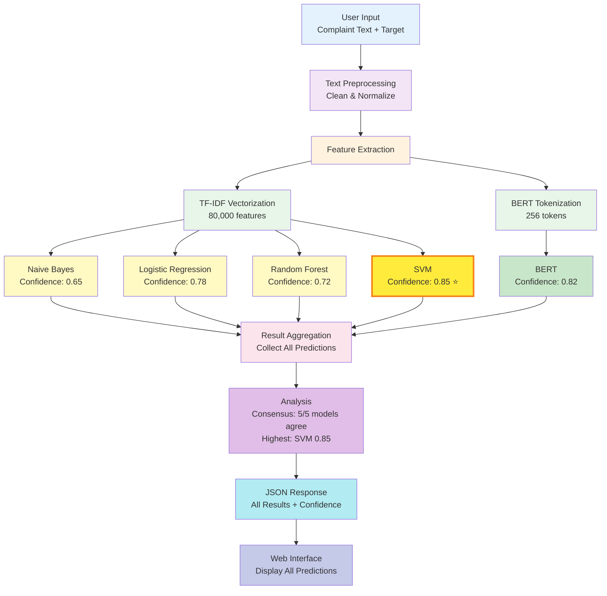

# Complaint Classification System - Flow Diagram
## Presentation-Ready System Architecture

---

## Complete System Flow Diagram

```
┌─────────────────────────────────────────────────────────────────────────────────────┐
│                          COMPLAINT CLASSIFICATION SYSTEM                            │
│                              Complete Flow Diagram                                   │
└─────────────────────────────────────────────────────────────────────────────────────┘

┌─────────────────────────────────────────────────────────────────────────────────────┐
│                                    USER INPUT                                       │
│  ┌──────────────────────────────────────────────────────────────────────────────┐ │
│  │                                                                              │ │
│  │  Complaint Text:                                                            │ │
│  │  "I have been trying to resolve an issue with my credit card statement.     │ │
│  │   The charges are incorrect and I have been charged fees..."                 │ │
│  │                                                                              │ │
│  │  Target Selection: [Product] [Issue]                                       │ │
│  │                                                                              │ │
│  └──────────────────────────────────────────────────────────────────────────────┘ │
└─────────────────────────────────────────────────────────────────────────────────────┘
                                        │
                                        ▼
┌─────────────────────────────────────────────────────────────────────────────────────┐
│                              STEP 1: TEXT PREPROCESSING                             │
│  ┌──────────────────────────────────────────────────────────────────────────────┐ │
│  │  • Remove extra whitespace                                                  │ │
│  │  • Normalize text format                                                    │ │
│  │  • Basic cleaning                                                            │ │
│  │                                                                              │ │
│  │  Output: Clean, normalized text ready for processing                        │ │
│  └──────────────────────────────────────────────────────────────────────────────┘ │
└─────────────────────────────────────────────────────────────────────────────────────┘
                                        │
                                        ▼
┌─────────────────────────────────────────────────────────────────────────────────────┐
│                          STEP 2: FEATURE EXTRACTION                                 │
│  ┌──────────────────────────────────────────────────────────────────────────────┐ │
│  │                                                                              │ │
│  │  ┌──────────────────────────────────┐  ┌──────────────────────────────────┐│ │
│  │  │  PATH A: TF-IDF VECTORIZATION    │  │  PATH B: BERT TOKENIZATION       ││ │
│  │  │                                  │  │                                  ││ │
│  │  │  Text → TF-IDF Vector            │  │  Text → Token IDs                ││ │
│  │  │  • 80,000 features              │  │  • Max 256 tokens                 ││ │
│  │  │  • 1-2 gram features            │  │  • Attention mask                ││ │
│  │  │  • Sparse matrix format          │  │  • Contextual encoding            ││ │
│  │  │                                  │  │                                  ││ │
│  │  │  Output: Sparse Vector           │  │  Output: Token Sequence          ││ │
│  │  │  Shape: (1, 80000)              │  │  Shape: (1, 256)                 ││ │
│  │  └──────────────────────────────────┘  └──────────────────────────────────┘│ │
│  └──────────────────────────────────────────────────────────────────────────────┘ │
└─────────────────────────────────────────────────────────────────────────────────────┘
                                        │
                    ┌───────────────────┴───────────────────┐
                    │                                       │
                    ▼                                       ▼
┌───────────────────────────────────────┐  ┌───────────────────────────────────────┐
│  STEP 3A: TF-IDF MODEL PREDICTIONS    │  │  STEP 3B: BERT MODEL PREDICTION      │
│  ┌───────────────────────────────────┐│  │  ┌─────────────────────────────────┐│
│  │                                   ││  │  │                                 ││
│  │  ┌──────────────┐  ┌──────────────┐││  │  │  Input: Token IDs +            ││
│  │  │ Naive Bayes  │  │ Logistic     │││  │  │         Attention Mask         ││
│  │  │              │  │ Regression   │││  │  │                                 ││
│  │  │ Input:       │  │              │││  │  │  Process:                      ││
│  │  │ TF-IDF Vector│  │ Input:       │││  │  │  1. Transformer Layers         ││
│  │  │              │  │ TF-IDF Vector│││  │  │  2. Contextual Embeddings      ││
│  │  │ Process:     │  │              │││  │  │  3. Classification Head        ││
│  │  │ Probabilistic│  │ Process:     │││  │  │  4. Softmax                    ││
│  │  │ Classification│  │ Linear       │││  │  │                                 ││
│  │  │              │  │ Classification│││  │  │  Output:                       ││
│  │  │ Output:      │  │              │││  │  │  • Class: Credit card          ││
│  │  │ • Class       │  │ Output:      │││  │  │  • Confidence: 0.82           ││
│  │  │ • Conf: 0.65  │  │ • Class      │││  │  │  • Top 3 Predictions           ││
│  │  │ • Top 3       │  │ • Conf: 0.78 │││  │  └─────────────────────────────────┘│
│  │  └──────────────┘  │ • Top 3       │││  └───────────────────────────────────────┘
│  │                    └──────────────┘││
│  │                                   ││
│  │  ┌──────────────┐  ┌──────────────┐││
│  │  │ Random       │  │ SVM         │││
│  │  │ Forest       │  │             │││
│  │  │              │  │ Input:     │││
│  │  │ Input:       │  │ TF-IDF     │││
│  │  │ TF-IDF Vector│  │ Vector     │││
│  │  │              │  │            │││
│  │  │ Process:     │  │ Process:   │││
│  │  │ Ensemble     │  │ SVM        │││
│  │  │ Voting       │  │ Classification│││
│  │  │              │  │            │││
│  │  │ Output:      │  │ Output:    │││
│  │  │ • Class      │  │ • Class    │││
│  │  │ • Conf: 0.72 │  │ • Conf: 0.85│││
│  │  │ • Top 3      │  │ • Top 3    │││
│  │  └──────────────┘  └──────────────┘││
│  │                                   ││
│  └───────────────────────────────────┘│
└───────────────────────────────────────┘
                    │                   │
                    └─────────┬─────────┘
                              │
                              ▼
┌─────────────────────────────────────────────────────────────────────────────────────┐
│                          STEP 4: ENSEMBLE AGGREGATION (SOFT VOTING)                 │
│  ┌──────────────────────────────────────────────────────────────────────────────┐ │
│  │  compute_ensemble_prediction() in app.py                                     │ │
│  │                                                                              │ │
│  │  1. Collect successful predictions from all 5 models                         │ │
│  │  2. Average class probability scores (from top_3 + confidence)               │ │
│  │  3. Pick class with highest average -> final_ensemble_prediction             │ │
│  │  4. Attach majority_vote metadata (e.g. 4/5 agree)                           │ │
│  │                                                                              │ │
│  │  Example output:                                                             │ │
│  │  • Final: "Credit card or prepaid card" (60.1%)                              │ │
│  │  • Majority: 4/5 models agree                                                │ │
│  │  • BERT dissent: predicted "Credit card" (57.2%)                             │ │
│  └──────────────────────────────────────────────────────────────────────────────┘ │
└─────────────────────────────────────────────────────────────────────────────────────┘
                                        │
                                        ▼
┌─────────────────────────────────────────────────────────────────────────────────────┐
│                          STEP 5: JSON RESPONSE FORMATTING                            │
│  ┌──────────────────────────────────────────────────────────────────────────────┐ │
│  │  {                                                                            │ │
│  │    "success": true,                                                           │ │
│  │    "target": "product",                                                       │ │
│  │    "timestamp": "2025-01-XX XX:XX:XX",                                       │ │
│  │    "final_ensemble_prediction": {                                            │ │
│  │      "prediction": "Credit card or prepaid card",                            │ │
│  │      "confidence": 0.601,                                                  │ │
│  │      "method": "soft_voting",                                                │ │
│  │      "models_used": ["Naive Bayes", "Logistic Regression", ...],             │ │
│  │      "majority_vote": { "prediction": "...", "votes": 4, "total": 5 }        │ │
│  │    },                                                                        │ │
│  │    "results": {                                                               │ │
│  │      "Naive Bayes": {                                                        │ │
│  │        "prediction": "Credit card",                                          │ │
│  │        "confidence": 0.65,                                                    │ │
│  │        "top_3": [                                                             │ │
│  │          {"class": "Credit card", "probability": 0.65},                      │ │
│  │          {"class": "Bank account", "probability": 0.20},                    │ │
│  │          {"class": "Mortgage", "probability": 0.15}                          │ │
│  │        ]                                                                      │ │
│  │      },                                                                       │ │
│  │      "Logistic Regression": {...},                                            │ │
│  │      "Random Forest": {...},                                                  │ │
│  │      "SVM": {...},                                                            │ │
│  │      "BERT": {...}                                                           │ │
│  │    }                                                                          │ │
│  │  }                                                                            │ │
│  └──────────────────────────────────────────────────────────────────────────────┘ │
└─────────────────────────────────────────────────────────────────────────────────────┘
                                        │
                                        ▼
┌─────────────────────────────────────────────────────────────────────────────────────┐
│                          STEP 6: WEB INTERFACE DISPLAY                              │
│  ┌──────────────────────────────────────────────────────────────────────────────┐ │
│  │                                                                              │ │
│  │  ┌──────────────────────────────────────────────────────────────────────┐  │ │
│  │  │                    PREDICTION RESULTS                                 │  │ │
│  │  │                                                                      │  │ │
│  │  │  ┌──────────────────────────────────────────────────────────────┐   │  │ │
│  │  │  │     FINAL ENSEMBLE PREDICTION (soft voting, highlighted)      │   │  │ │
│  │  │  │  Credit card or prepaid card | 60.1% | Majority 4/5           │   │  │ │
│  │  │  └──────────────────────────────────────────────────────────────┘   │  │ │
│  │  │                                                                      │  │ │
│  │  │  Individual Model Predictions:                                      │  │ │
│  │  │  ┌──────────────────────────────────────────────────────────────┐   │  │ │
│  │  │  │ 🤖 Naive Bayes                                               │   │  │ │
│  │  │  │ Predicted Category: Credit card                              │   │  │ │
│  │  │  │ Confidence: 65.0% ████████████░░░░░░░░░░                    │   │  │ │
│  │  │  │ Top 3: Credit card (65%), Bank account (20%), Mortgage (15%) │   │  │ │
│  │  │  └──────────────────────────────────────────────────────────────┘   │  │ │
│  │  │                                                                      │  │ │
│  │  │  ┌──────────────────────────────────────────────────────────────┐   │  │ │
│  │  │  │ 🤖 Logistic Regression                                        │   │  │ │
│  │  │  │ Predicted Category: Credit card                              │   │  │ │
│  │  │  │ Confidence: 78.0% ████████████████░░░░░░                    │   │  │ │
│  │  │  └──────────────────────────────────────────────────────────────┘   │  │ │
│  │  │                                                                      │  │ │
│  │  │  ┌──────────────────────────────────────────────────────────────┐   │  │ │
│  │  │  │ 🤖 Random Forest                                              │   │  │ │
│  │  │  │ Predicted Category: Credit card                              │   │  │ │
│  │  │  │ Confidence: 72.0% ██████████████░░░░░░░░                    │   │  │ │
│  │  │  └──────────────────────────────────────────────────────────────┘   │  │ │
│  │  │                                                                      │  │ │
│  │  │  ┌──────────────────────────────────────────────────────────────┐   │  │ │
│  │  │  │ 🤖 SVM ⭐ HIGHEST CONFIDENCE                                  │   │  │ │
│  │  │  │ Predicted Category: Credit card                              │   │  │ │
│  │  │  │ Confidence: 85.0% ████████████████████░░░░                  │   │  │ │
│  │  │  └──────────────────────────────────────────────────────────────┘   │  │ │
│  │  │                                                                      │  │ │
│  │  │  ┌──────────────────────────────────────────────────────────────┐   │  │ │
│  │  │  │ 🤖 BERT                                                       │   │  │ │
│  │  │  │ Predicted Category: Credit card                              │   │  │ │
│  │  │  │ Confidence: 82.0% ██████████████████░░░░░░                  │   │  │ │
│  │  │  └──────────────────────────────────────────────────────────────┘   │  │ │
│  │  │                                                                      │  │ │
│  │  │  Summary: All 5 models agree on "Credit card"                       │  │ │
│  │  │  Highest Confidence: SVM (85.0%)                                   │  │ │
│  │  └──────────────────────────────────────────────────────────────────────┘  │ │
│  └──────────────────────────────────────────────────────────────────────────────┘ │
└─────────────────────────────────────────────────────────────────────────────────────┘
```

---

## Simplified High-Level Flow (For Quick Overview)

```
┌──────────────┐
│  USER INPUT  │  Complaint Text + Target Selection
└──────┬───────┘
       │
       ▼
┌──────────────┐
│ PREPROCESS   │  Clean & Normalize Text
└──────┬───────┘
       │
       ▼
┌──────────────┐
│   EXTRACT    │  TF-IDF Features + BERT Tokens
│   FEATURES   │
└──────┬───────┘
       │
       ├─────────────────────────────────┐
       │                                 │
       ▼                                 ▼
┌──────────────┐              ┌──────────────┐
│  TF-IDF      │              │    BERT      │
│  MODELS      │              │    MODEL     │
│              │              │              │
│ • Naive Bayes│              │ • Transformer│
│ • Log. Reg.  │              │ • Contextual │
│ • Rand. For. │              │ • Fine-tuned │
│ • SVM        │              │              │
└──────┬───────┘              └──────┬───────┘
       │                            │
       └────────────┬───────────────┘
                    │
                    ▼
         ┌──────────────────┐
         │   AGGREGATE      │  Collect All Predictions
         │   RESULTS        │  Calculate Confidence
         └─────────┬────────┘
                   │
                   ▼
         ┌──────────────────┐
         │   DISPLAY        │  Show All Model Results
         │   RESULTS        │  With Confidence Scores
         └──────────────────┘
```

---

## Training Phase Flow Diagram

```
┌─────────────────────────────────────────────────────────────────────────────────────┐
│                              MODEL TRAINING PHASE                                  │
└─────────────────────────────────────────────────────────────────────────────────────┘

┌──────────────────────┐
│   RAW DATA           │  78,313 complaints
│   (JSON Format)      │
└──────────┬───────────┘
           │
           ▼
┌──────────────────────┐
│   DATA CLEANING      │  Remove missing values
│                      │  Filter empty strings
│   Result: ~21,000    │
└──────────┬───────────┘
           │
           ▼
┌──────────────────────┐
│   CLASS FILTERING    │  Top 10 classes per target
│                      │  Product: 20,777 records
│                      │  Issue: 9,672 records
└──────────┬───────────┘
           │
           ▼
┌──────────────────────┐
│   TEXT PREPROCESSING │  Normalize whitespace
│                      │  Basic cleaning
└──────────┬───────────┘
           │
           ▼
┌──────────────────────┐
│   FEATURE EXTRACTION │
│                      │
│  ┌──────────────┐   │  ┌──────────────┐
│  │ TF-IDF       │   │  │ BERT Prep    │
│  │ • 80K features│   │  │ • 256 tokens │
│  │ • 1-2 grams  │   │  │ • Sampling   │
│  └──────────────┘   │  └──────────────┘
└──────────┬───────────┘
           │
           ▼
┌──────────────────────┐
│   DATA SPLITTING     │  Train: 80% | Test: 20%
│   (Stratified)       │  Random State: 42
└──────────┬───────────┘
           │
           ▼
┌──────────────────────────────────────────────────────────┐
│              MODEL TRAINING (PARALLEL)                   │
│                                                          │
│  ┌──────────────┐  ┌──────────────┐  ┌──────────────┐ │
│  │ Naive Bayes  │  │ Log. Reg.    │  │ Rand. Forest │ │
│  │ α=0.8        │  │ C=2.0        │  │ n=300       │ │
│  └──────────────┘  └──────────────┘  └──────────────┘ │
│                                                          │
│  ┌──────────────┐  ┌──────────────┐                    │
│  │ SVM          │  │ BERT         │                    │
│  │ C=2.0        │  │ Fine-tuning  │                    │
│  └──────────────┘  └──────────────┘                    │
└──────────────────────────────────────────────────────────┘
           │
           ▼
┌──────────────────────┐
│   EVALUATION         │  Test set accuracy
│                      │  Classification reports
└──────────┬───────────┘
           │
           ▼
┌──────────────────────┐
│   MODEL SAVING        │  Pickle files (TF-IDF)
│                      │  HuggingFace format (BERT)
└──────────────────────┘
```

---

## Ensemble Approach Flow

```
┌─────────────────────────────────────────────────────────────────────────────────────┐
│                        MULTI-MODEL ENSEMBLE APPROACH                                │
└─────────────────────────────────────────────────────────────────────────────────────┘

                    INPUT: Complaint Text
                           │
                           ▼
        ┌──────────────────────────────────────┐
        │   Why Multiple Models?              │
        │                                     │
        │   Different models excel in         │
        │   different scenarios:              │
        │                                     │
        │   • Simple text → Naive Bayes       │
        │   • Linear patterns → Log. Reg.     │
        │   • Complex patterns → Rand. For.   │
        │   • High accuracy → SVM              │
        │   • Context-aware → BERT            │
        └──────────────────────────────────────┘
                           │
                           ▼
        ┌──────────────────────────────────────┐
        │   PARALLEL EXECUTION                 │
        │                                     │
        │   All models process simultaneously  │
        │   No dependency between models       │
        └──────────────────────────────────────┘
                           │
        ┌───────────────────┼───────────────────┐
        │                   │                   │
        ▼                   ▼                   ▼
┌──────────────┐   ┌──────────────┐   ┌──────────────┐
│ Naive Bayes  │   │ Log. Reg.    │   │ Rand. Forest │
│ Confidence:  │   │ Confidence:  │   │ Confidence:  │
│ 0.65         │   │ 0.78         │   │ 0.72         │
└──────────────┘   └──────────────┘   └──────────────┘
        │                   │                   │
        └───────────────────┼───────────────────┘
                            │
        ┌───────────────────┼───────────────────┐
        │                   │                   │
        ▼                   ▼                   ▼
┌──────────────┐   ┌──────────────────────────────┐
│ SVM          │   │ BERT                        │
│ Confidence:  │   │ Confidence:                 │
│ 0.85 ⭐      │   │ 0.82                        │
│ HIGHEST      │   │                              │
└──────────────┘   └──────────────────────────────┘
        │                   │
        └─────────┬─────────┘
                  │
                  ▼
        ┌──────────────────────┐
        │   RESULT ANALYSIS     │
        │                       │
        │   • All agree?        │
        │   • Highest confidence│
        │   • Consensus level   │
        │   • Reliability score │
        └──────────────────────┘
                  │
                  ▼
        ┌──────────────────────┐
        │   DISPLAY ALL        │
        │   PREDICTIONS         │
        │                       │
        │   User sees:          │
        │   • All 5 results     │
        │   • Confidence scores │
        │   • Top 3 alternatives│
        │   • Can assess        │
        │     reliability       │
        └──────────────────────┘

┌─────────────────────────────────────────────────────────────────────────────────────┐
│  BENEFITS OF THIS APPROACH                                                          │
│                                                                                     │
│  ✓ Robustness: No single point of failure                                         │
│  ✓ Transparency: Users see all predictions                                         │
│  ✓ Flexibility: Different models for different cases                              │
│  ✓ Confidence Assessment: Multiple confidence scores                               │
│  ✓ Reliability: Consensus indicates strong predictions                             │
└─────────────────────────────────────────────────────────────────────────────────────┘
```

---

## Mermaid Diagram (For Presentation Tools)



---

## Key Points for Presentation

### 1. **System Overview**
- Multi-model ensemble approach
- 5 different models working in parallel
- Confidence-based selection

### 2. **Why Multiple Models?**
- Different models excel in different scenarios
- Robustness through diversity
- No single point of failure

### 3. **Flow Highlights**
- **Input**: User complaint text
- **Processing**: Parallel model execution
- **Output**: All predictions with confidence scores
- **Display**: Transparent results for user assessment

### 4. **Key Features**
- ✅ Real-time predictions
- ✅ Multiple model consensus
- ✅ Confidence scoring
- ✅ Top 3 alternatives per model
- ✅ Web-based interface

---

**Document Version**: 1.0  
**For**: Presentation Use  
**Last Updated**: 2025

