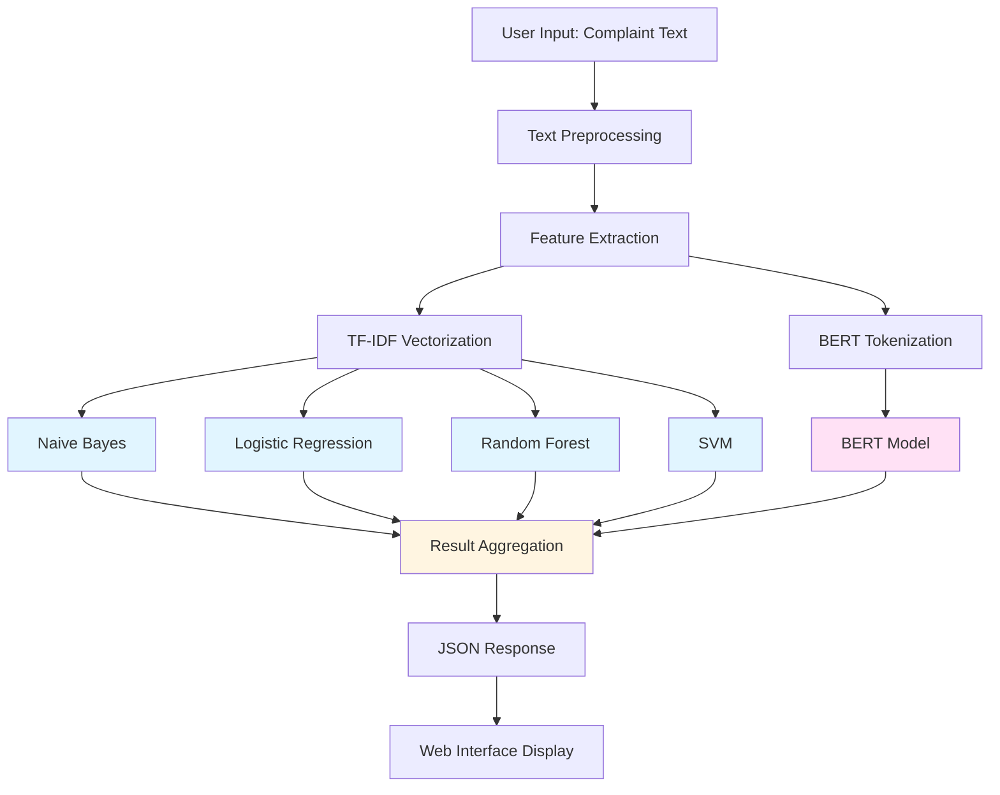

# System Architecture Diagrams

This document contains visual representations of the Complaint Classification System architecture.

## Table of Contents
1. [System Overview Diagram](#system-overview-diagram)
2. [Model Training Flow](#model-training-flow)
3. [Prediction Flow](#prediction-flow)
4. [Data Pipeline](#data-pipeline)
5. [Model Comparison](#model-comparison)

---

## System Overview Diagram

```
┌─────────────────────────────────────────────────────────────────────────────┐
│                          USER INTERFACE LAYER                               │
│                                                                             │
│  ┌───────────────────────────────────────────────────────────────────────┐ │
│  │                    Web Browser (Frontend)                             │ │
│  │  ┌───────────────────────────────────────────────────────────────┐  │ │
│  │  │  Input Form:                                                   │  │ │
│  │  │  - Complaint Text Area                                         │  │ │
│  │  │  - Target Selection (Product/Issue)                           │  │ │
│  │  │  - Analyze Button                                             │  │ │
│  │  └───────────────────────────────────────────────────────────────┘  │ │
│  │                                                                       │ │
│  │  ┌───────────────────────────────────────────────────────────────┐  │ │
│  │  │  Results Display:                                              │  │ │
│  │  │  - Model Predictions                                            │  │ │
│  │  │  - Confidence Scores                                            │  │ │
│  │  │  - Top 3 Predictions per Model                                 │  │ │
│  │  └───────────────────────────────────────────────────────────────┘  │ │
│  └───────────────────────────────────────────────────────────────────────┘ │
└─────────────────────────────────────────────────────────────────────────────┘
                                    ↕ HTTP/JSON
┌─────────────────────────────────────────────────────────────────────────────┐
│                         FLASK APPLICATION SERVER                             │
│                                                                             │
│  ┌───────────────────────────────────────────────────────────────────────┐ │
│  │                      API Layer                                        │ │
│  │  ┌──────────────┐  ┌──────────────┐  ┌──────────────┐               │ │
│  │  │ GET /        │  │ POST /predict│  │ GET /models/ │               │ │
│  │  │ (Home Page)  │  │ (Predictions)│  │ status       │               │ │
│  │  └──────────────┘  └──────────────┘  └──────────────┘               │ │
│  └───────────────────────────────────────────────────────────────────────┘ │
│                                                                             │
│  ┌───────────────────────────────────────────────────────────────────────┐ │
│  │                    Request Processing Layer                            │ │
│  │  - Input Validation                                                   │ │
│  │  - Text Preprocessing                                                 │ │
│  │  - Route to Prediction Engine                                         │ │
│  └───────────────────────────────────────────────────────────────────────┘ │
└─────────────────────────────────────────────────────────────────────────────┘
                                    ↕
┌─────────────────────────────────────────────────────────────────────────────┐
│                         MODEL MANAGEMENT LAYER                              │
│                                                                             │
│  ┌───────────────────────────────────────────────────────────────────────┐ │
│  │                    Model Loading System                                │ │
│  │                                                                        │ │
│  │  ┌──────────────────────────┐    ┌──────────────────────────┐      │ │
│  │  │   TF-IDF Models          │    │   BERT Models            │      │ │
│  │  │                          │    │                          │      │ │
│  │  │  Product Models:         │    │  Product BERT:          │      │ │
│  │  │  • Naive Bayes           │    │  • Model                 │      │ │
│  │  │  • Logistic Regression   │    │  • Tokenizer            │      │ │
│  │  │  • Random Forest         │    │  • Label Encoder         │      │ │
│  │  │  • SVM                   │    │                          │      │ │
│  │  │                          │    │  Issue BERT:            │      │ │
│  │  │  Issue Models:           │    │  • Model                 │      │ │
│  │  │  • Naive Bayes           │    │  • Tokenizer            │      │ │
│  │  │  • Logistic Regression   │    │  • Label Encoder         │      │ │
│  │  │  • Random Forest         │    │                          │      │ │
│  │  │  • SVM                   │    │                          │      │ │
│  │  │                          │    │                          │      │ │
│  │  │  Shared Components:      │    │                          │      │ │
│  │  │  • TF-IDF Vectorizers    │    │                          │      │ │
│  │  │  • Label Encoders        │    │                          │      │ │
│  │  └──────────────────────────┘    └──────────────────────────┘      │ │
│  └───────────────────────────────────────────────────────────────────────┘ │
└─────────────────────────────────────────────────────────────────────────────┘
                                    ↕
┌─────────────────────────────────────────────────────────────────────────────┐
│                         PREDICTION ENGINE                                   │
│                                                                             │
│  ┌───────────────────────────────────────────────────────────────────────┐ │
│  │                    Text Preprocessing                                   │ │
│  │  Input: Raw Complaint Text                                             │ │
│  │  Output: Cleaned, Normalized Text                                       │ │
│  └───────────────────────────────────────────────────────────────────────┘ │
│                                    ↕                                        │
│  ┌───────────────────────────────────────────────────────────────────────┐ │
│  │                    Feature Extraction                                   │ │
│  │                                                                        │ │
│  │  ┌──────────────────────────┐    ┌──────────────────────────┐      │ │
│  │  │  TF-IDF Vectorization     │    │  BERT Tokenization      │      │ │
│  │  │                           │    │                         │      │ │
│  │  │  Text → Sparse Vector     │    │  Text → Token IDs       │      │ │
│  │  │  (80,000 features)        │    │  (Max 256 tokens)        │      │ │
│  │  └──────────────────────────┘    └──────────────────────────┘      │ │
│  └───────────────────────────────────────────────────────────────────────┘ │
│                                    ↕                                        │
│  ┌───────────────────────────────────────────────────────────────────────┐ │
│  │                    Parallel Model Execution                            │ │
│  │                                                                        │ │
│  │  ┌──────────────┐  ┌──────────────┐  ┌──────────────┐  ┌──────────────┐│ │
│  │  │ Naive Bayes   │  │ Log. Reg.   │  │ Rand. Forest│  │ SVM         ││ │
│  │  │               │  │              │  │              │  │             ││ │
│  │  │ Input:        │  │ Input:       │  │ Input:       │  │ Input:      ││ │
│  │  │ TF-IDF Vector │  │ TF-IDF Vector│  │ TF-IDF Vector│  │ TF-IDF Vector││ │
│  │  │               │  │              │  │              │  │             ││ │
│  │  │ Process:      │  │ Process:      │  │ Process:      │  │ Process:    ││ │
│  │  │ Probabilistic │  │ Linear       │  │ Ensemble      │  │ SVM         ││ │
│  │  │ Classification│  │ Classification│  │ Voting        │  │ Classification││ │
│  │  │               │  │              │  │              │  │             ││ │
│  │  │ Output:       │  │ Output:      │  │ Output:       │  │ Output:     ││ │
│  │  │ • Class       │  │ • Class       │  │ • Class       │  │ • Class     ││ │
│  │  │ • Confidence  │  │ • Confidence │  │ • Confidence  │  │ • Confidence││ │
│  │  │ • Top 3       │  │ • Top 3      │  │ • Top 3       │  │ • Top 3     ││ │
│  │  └──────────────┘  └──────────────┘  └──────────────┘  └──────────────┘│ │
│  │                                                                        │ │
│  │  ┌──────────────────────────────────────────────────────────────┐    │ │
│  │  │                    BERT Model                                 │    │ │
│  │  │                                                               │    │ │
│  │  │  Input: Token IDs + Attention Mask                           │    │ │
│  │  │                                                               │    │ │
│  │  │  Process:                                                     │    │ │
│  │  │  1. Transformer Layers (Context Understanding)               │    │ │
│  │  │  2. Classification Head                                      │    │ │
│  │  │  3. Softmax (Probability Distribution)                       │    │ │
│  │  │                                                               │    │ │
│  │  │  Output:                                                      │    │ │
│  │  │  • Class                                                      │    │ │
│  │  │  • Confidence                                                 │    │ │
│  │  │  • Top 3 Predictions                                          │    │ │
│  │  └──────────────────────────────────────────────────────────────┘    │ │
│  └───────────────────────────────────────────────────────────────────────┘ │
│                                    ↕                                        │
│  ┌───────────────────────────────────────────────────────────────────────┐ │
│  │                    Result Aggregation                                   │ │
│  │  - Collect all model predictions                                      │ │
│  │  - Format results                                                      │ │
│  │  - Calculate confidence scores                                         │ │
│  │  - Prepare JSON response                                               │ │
│  └───────────────────────────────────────────────────────────────────────┘ │
└─────────────────────────────────────────────────────────────────────────────┘
                                    ↕
┌─────────────────────────────────────────────────────────────────────────────┐
│                         RESPONSE FORMATTING                                  │
│                                                                             │
│  ┌───────────────────────────────────────────────────────────────────────┐ │
│  │                    JSON Response Structure                              │ │
│  │  {                                                                     │ │
│  │    "success": true,                                                    │ │
│  │    "target": "product",                                                 │ │
│  │    "timestamp": "2025-01-XX XX:XX:XX",                                 │ │
│  │    "final_ensemble_prediction": {                                      │ │
│  │      "prediction": "Credit card or prepaid card",                      │ │
│  │      "confidence": 0.601,                                              │ │
│  │      "method": "soft_voting",                                          │ │
│  │      "majority_vote": { "votes": 4, "total": 5 }                       │ │
│  │    },                                                                  │ │
│  │    "results": {                                                        │ │
│  │      "Naive Bayes": {                                                  │ │
│  │        "prediction": "Credit card",                                    │ │
│  │        "confidence": 0.65,                                              │ │
│  │        "top_3": [...]                                                  │ │
│  │      },                                                                 │ │
│  │      "Logistic Regression": {...},                                      │ │
│  │      "Random Forest": {...},                                            │ │
│  │      "SVM": {...},                                                     │ │
│  │      "BERT": {...}                                                     │ │
│  │    }                                                                    │ │
│  │  }                                                                     │ │
│  └───────────────────────────────────────────────────────────────────────┘ │
└─────────────────────────────────────────────────────────────────────────────┘
```

---

## Model Training Flow

```
┌─────────────────────────────────────────────────────────────────────────────┐
│                         TRAINING PHASE                                      │
└─────────────────────────────────────────────────────────────────────────────┘

┌─────────────────────────────────────────────────────────────────────────────┐
│  STEP 1: DATA LOADING                                                      │
│  ┌──────────────────────────────────────────────────────────────────────┐ │
│  │  Source: complaints-2021-05-14_08_16.json                            │ │
│  │  Total Records: 78,313 complaints                                     │ │
│  │  Fields: complaint_what_happened, product, issue                     │ │
│  └──────────────────────────────────────────────────────────────────────┘ │
└─────────────────────────────────────────────────────────────────────────────┘
                              ↓
┌─────────────────────────────────────────────────────────────────────────────┐
│  STEP 2: DATA CLEANING                                                     │
│  ┌──────────────────────────────────────────────────────────────────────┐ │
│  │  • Remove missing values                                             │ │
│  │  • Filter empty strings                                              │ │
│  │  • Result: ~21,000 clean records                                    │ │
│  └──────────────────────────────────────────────────────────────────────┘ │
└─────────────────────────────────────────────────────────────────────────────┘
                              ↓
┌─────────────────────────────────────────────────────────────────────────────┐
│  STEP 3: CLASS FILTERING                                                   │
│  ┌──────────────────────────────────────────────────────────────────────┐ │
│  │  • Filter to top 10 classes per target                              │ │
│  │  • Product: 20,777 records                                         │ │
│  │  • Issue: 9,672 records                                             │ │
│  └──────────────────────────────────────────────────────────────────────┘ │
└─────────────────────────────────────────────────────────────────────────────┘
                              ↓
┌─────────────────────────────────────────────────────────────────────────────┐
│  STEP 4: TEXT PREPROCESSING                                                │
│  ┌──────────────────────────────────────────────────────────────────────┐ │
│  │  • Normalize whitespace                                               │ │
│  │  • Basic text cleaning                                                │ │
│  │  • Create processed text column                                       │ │
│  └──────────────────────────────────────────────────────────────────────┘ │
└─────────────────────────────────────────────────────────────────────────────┘
                              ↓
┌─────────────────────────────────────────────────────────────────────────────┐
│  STEP 5: FEATURE EXTRACTION                                                │
│  ┌──────────────────────────────────────────────────────────────────────┐ │
│  │                                                                      │ │
│  │  ┌──────────────────────────┐    ┌──────────────────────────┐    │ │
│  │  │  TF-IDF Vectorization    │    │  BERT Preparation        │    │ │
│  │  │                          │    │                          │    │ │
│  │  │  Parameters:             │    │  Parameters:             │    │ │
│  │  │  • Max features: 80K    │    │  • Max length: 256     │    │ │
│  │  │  • N-grams: (1,2)        │    │  • Max samples: 500/class│    │ │
│  │  │  • Min DF: 2            │    │  • Batch size: 8        │    │ │
│  │  │  • Max DF: 0.98         │    │  • Learning rate: 2e-5   │    │ │
│  │  │  • Sublinear TF: True   │    │  • Epochs: 1            │    │ │
│  │  └──────────────────────────┘    └──────────────────────────┘    │ │
│  └──────────────────────────────────────────────────────────────────────┘ │
└─────────────────────────────────────────────────────────────────────────────┘
                              ↓
┌─────────────────────────────────────────────────────────────────────────────┐
│  STEP 6: DATA SPLITTING                                                    │
│  ┌──────────────────────────────────────────────────────────────────────┐ │
│  │  • Train: 80%                                                        │ │
│  │  • Test: 20%                                                         │ │
│  │  • Stratified split (maintains class distribution)                    │ │
│  │  • Random state: 42 (reproducibility)                                │ │
│  └──────────────────────────────────────────────────────────────────────┘ │
└─────────────────────────────────────────────────────────────────────────────┘
                              ↓
┌─────────────────────────────────────────────────────────────────────────────┐
│  STEP 7: MODEL TRAINING (PARALLEL)                                         │
│  ┌──────────────────────────────────────────────────────────────────────┐ │
│  │                                                                      │ │
│  │  ┌──────────────┐  ┌──────────────┐  ┌──────────────┐            │ │
│  │  │ Naive Bayes  │  │ Log. Reg.    │  │ Rand. Forest │            │ │
│  │  │              │  │              │  │              │            │ │
│  │  │ • Fast       │  │ • Linear     │  │ • Ensemble   │            │ │
│  │  │ • Probabilistic│  │ • Interpretable│  │ • Non-linear │            │ │
│  │  │ • α=0.8      │  │ • C=2.0      │  │ • n=300      │            │ │
│  │  │              │  │ • Balanced   │  │ • Max depth=None│            │ │
│  │  └──────────────┘  └──────────────┘  └──────────────┘            │ │
│  │                                                                      │ │
│  │  ┌──────────────┐  ┌──────────────┐                               │ │
│  │  │ SVM          │  │ BERT         │                               │ │
│  │  │              │  │              │                               │ │
│  │  │ • Linear     │  │ • Transformer│                               │ │
│  │  │ • C=2.0      │  │ • Fine-tuned │                               │ │
│  │  │ • Balanced   │  │ • Context-aware│                               │ │
│  │  └──────────────┘  └──────────────┘                               │ │
│  └──────────────────────────────────────────────────────────────────────┘ │
└─────────────────────────────────────────────────────────────────────────────┘
                              ↓
┌─────────────────────────────────────────────────────────────────────────────┐
│  STEP 8: MODEL EVALUATION                                                  │
│  ┌──────────────────────────────────────────────────────────────────────┐ │
│  │  • Test set predictions                                                │ │
│  │  • Accuracy calculation                                               │ │
│  │  • Classification reports                                             │ │
│  │  • Confusion matrices                                                │ │
│  └──────────────────────────────────────────────────────────────────────┘ │
└─────────────────────────────────────────────────────────────────────────────┘
                              ↓
┌─────────────────────────────────────────────────────────────────────────────┐
│  STEP 9: MODEL SAVING                                                      │
│  ┌──────────────────────────────────────────────────────────────────────┐ │
│  │  TF-IDF Models:                    BERT Models:                    │ │
│  │  • models/{target}_{model}.pkl      • bert_model_{target}/          │ │
│  │  • models/{target}_vectorizer.pkl  • model.safetensors              │ │
│  │  • models/{target}_encoder.pkl     • tokenizer files                │ │
│  │                                     • label_encoder.pkl              │ │
│  └──────────────────────────────────────────────────────────────────────┘ │
└─────────────────────────────────────────────────────────────────────────────┘
```

---

## Prediction Flow

```
┌─────────────────────────────────────────────────────────────────────────────┐
│                         PREDICTION PHASE                                    │
└─────────────────────────────────────────────────────────────────────────────┘

┌─────────────────────────────────────────────────────────────────────────────┐
│  INPUT: User Complaint Text + Target Selection                              │
│  ┌──────────────────────────────────────────────────────────────────────┐ │
│  │  Example:                                                            │ │
│  │  "I have been trying to resolve an issue with my credit card         │ │
│  │   statement. The charges are incorrect..."                          │ │
│  │  Target: Product                                                     │ │
│  └──────────────────────────────────────────────────────────────────────┘ │
└─────────────────────────────────────────────────────────────────────────────┘
                              ↓
┌─────────────────────────────────────────────────────────────────────────────┐
│  TEXT PREPROCESSING                                                        │
│  ┌──────────────────────────────────────────────────────────────────────┐ │
│  │  • Remove extra whitespace                                           │ │
│  │  • Clean text                                                        │ │
│  │  • Normalize format                                                  │ │
│  └──────────────────────────────────────────────────────────────────────┘ │
└─────────────────────────────────────────────────────────────────────────────┘
                              ↓
┌─────────────────────────────────────────────────────────────────────────────┐
│  FEATURE EXTRACTION (PARALLEL)                                             │
│  ┌──────────────────────────────────────────────────────────────────────┐ │
│  │                                                                      │ │
│  │  ┌──────────────────────────┐    ┌──────────────────────────┐    │ │
│  │  │  TF-IDF Vectorization    │    │  BERT Tokenization      │    │ │
│  │  │                          │    │                          │    │ │
│  │  │  Text → Sparse Vector    │    │  Text → Token IDs       │    │ │
│  │  │  Shape: (1, 80000)       │    │  Shape: (1, 256)         │    │ │
│  │  └──────────────────────────┘    └──────────────────────────┘    │ │
│  └──────────────────────────────────────────────────────────────────────┘ │
└─────────────────────────────────────────────────────────────────────────────┘
                              ↓
┌─────────────────────────────────────────────────────────────────────────────┐
│  MODEL PREDICTIONS (PARALLEL EXECUTION)                                    │
│  ┌──────────────────────────────────────────────────────────────────────┐ │
│  │                                                                      │ │
│  │  ┌──────────────────────────────────────────────────────────────┐  │ │
│  │  │  TF-IDF Models                                                │  │ │
│  │  │  ┌──────────┐  ┌──────────┐  ┌──────────┐  ┌──────────┐    │  │ │
│  │  │  │ Naive    │  │ Logistic │  │ Random   │  │ SVM      │    │  │ │
│  │  │  │ Bayes    │  │ Regression│  │ Forest   │  │          │    │  │ │
│  │  │  │          │  │          │  │          │  │          │    │  │ │
│  │  │  │ Input:   │  │ Input:   │  │ Input:   │  │ Input:   │    │  │ │
│  │  │  │ TF-IDF   │  │ TF-IDF   │  │ TF-IDF   │  │ TF-IDF   │    │  │ │
│  │  │  │ Vector   │  │ Vector   │  │ Vector   │  │ Vector   │    │  │ │
│  │  │  │          │  │          │  │          │  │          │    │  │ │
│  │  │  │ Output:  │  │ Output:  │  │ Output:  │  │ Output:  │    │  │ │
│  │  │  │ • Class  │  │ • Class  │  │ • Class  │  │ • Class  │    │  │ │
│  │  │  │ • Conf:  │  │ • Conf:  │  │ • Conf:  │  │ • Conf:  │    │  │ │
│  │  │  │ 0.65     │  │ 0.78     │  │ 0.72     │  │ 0.85     │    │  │ │
│  │  │  │ • Top 3  │  │ • Top 3  │  │ • Top 3  │  │ • Top 3  │    │  │ │
│  │  │  └──────────┘  └──────────┘  └──────────┘  └──────────┘    │  │ │
│  │  └──────────────────────────────────────────────────────────────┘  │ │
│  │                                                                      │ │
│  │  ┌──────────────────────────────────────────────────────────────┐  │ │
│  │  │  BERT Model                                                   │  │ │
│  │  │  ┌──────────────────────────────────────────────────────────┐  │  │ │
│  │  │  │ Input: Token IDs + Attention Mask                       │  │  │ │
│  │  │  │                                                          │  │  │ │
│  │  │  │ Process:                                                 │  │  │ │
│  │  │  │ 1. Transformer Encoder Layers                           │  │  │ │
│  │  │  │ 2. Contextual Embeddings                                 │  │  │ │
│  │  │  │ 3. Classification Head                                    │  │  │ │
│  │  │  │ 4. Softmax → Probabilities                               │  │  │ │
│  │  │  │                                                          │  │  │ │
│  │  │  │ Output:                                                  │  │  │ │
│  │  │  │ • Class: Credit card                                     │  │  │ │
│  │  │  │ • Confidence: 0.82                                       │  │  │ │
│  │  │  │ • Top 3 Predictions                                      │  │  │ │
│  │  │  └──────────────────────────────────────────────────────────┘  │  │ │
│  │  └──────────────────────────────────────────────────────────────┘  │ │
│  └──────────────────────────────────────────────────────────────────────┘ │
└─────────────────────────────────────────────────────────────────────────────┘
                              ↓
┌─────────────────────────────────────────────────────────────────────────────┐
│  RESULT AGGREGATION                                                         │
│  ┌──────────────────────────────────────────────────────────────────────┐ │
│  │  Collect all predictions:                                           │ │
│  │  • Naive Bayes:      Credit card (0.65)                             │ │
│  │  • Logistic Reg:      Credit card (0.78)                             │ │
│  │  • Random Forest:    Credit card (0.72)                            │ │
│  │  • SVM:              Credit card (0.85) ← Highest Confidence      │ │
│  │  • BERT:             Credit card (0.57) — may dissent from TF-IDF   │ │
│  │                                                                      │ │
│  │  Final ensemble (soft voting): Credit card or prepaid card (0.60)   │ │
│  │  Majority vote: 4/5 models agree                                    │ │
│  └──────────────────────────────────────────────────────────────────────┘ │
└─────────────────────────────────────────────────────────────────────────────┘
                              ↓
┌─────────────────────────────────────────────────────────────────────────────┐
│  JSON RESPONSE                                                              │
│  ┌──────────────────────────────────────────────────────────────────────┐ │
│  │  {                                                                  │ │
│  │    "success": true,                                                  │ │
│  │    "target": "product",                                             │ │
│  │    "final_ensemble_prediction": { "prediction": "...", ... },       │ │
│  │    "results": {                                                      │ │
│  │      "Naive Bayes": {...},                                          │ │
│  │      "Logistic Regression": {...},                                   │ │
│  │      "Random Forest": {...},                                         │ │
│  │      "SVM": {...},                                                   │ │
│  │      "BERT": {...}                                                   │ │
│  │    }                                                                 │ │
│  │  }                                                                  │ │
│  └──────────────────────────────────────────────────────────────────────┘ │
└─────────────────────────────────────────────────────────────────────────────┘
                              ↓
┌─────────────────────────────────────────────────────────────────────────────┐
│  DISPLAY IN WEB INTERFACE                                                  │
│  ┌──────────────────────────────────────────────────────────────────────┐ │
│  │  User sees all model predictions with confidence scores             │ │
│  │  Can assess reliability based on consensus and confidence         │ │
│  └──────────────────────────────────────────────────────────────────────┘ │
└─────────────────────────────────────────────────────────────────────────────┘
```

---

## Data Pipeline

```
┌─────────────────────────────────────────────────────────────────────────────┐
│                         DATA PIPELINE                                        │
└─────────────────────────────────────────────────────────────────────────────┘

RAW DATA (78,313 complaints)
    │
    ├─ complaint_what_happened (text)
    ├─ product (label)
    └─ issue (label)
    │
    ↓
┌─────────────────────────────────────────────────────────────────────────────┐
│  DATA CLEANING                                                               │
│  • Remove missing values                                                    │
│  • Filter empty strings                                                     │
│  • Result: ~21,000 clean records                                           │
└─────────────────────────────────────────────────────────────────────────────┘
    │
    ↓
┌─────────────────────────────────────────────────────────────────────────────┐
│  CLASS FILTERING                                                            │
│  • Filter to top 10 classes per target                                      │
│  • Product: 20,777 records                                                 │
│  • Issue: 9,672 records                                                    │
└─────────────────────────────────────────────────────────────────────────────┘
    │
    ↓
┌─────────────────────────────────────────────────────────────────────────────┐
│  TEXT PREPROCESSING                                                         │
│  • Normalize whitespace                                                     │
│  • Basic cleaning                                                           │
│  • Create 'text_processed' column                                           │
└─────────────────────────────────────────────────────────────────────────────┘
    │
    ↓
┌─────────────────────────────────────────────────────────────────────────────┐
│  FEATURE EXTRACTION                                                         │
│  ┌──────────────────────────┐    ┌──────────────────────────┐            │
│  │  TF-IDF                  │    │  BERT                    │            │
│  │                          │    │                          │            │
│  │  Text → TF-IDF Vector    │    │  Text → Tokens          │            │
│  │  • 80,000 features        │    │  • Max 256 tokens        │            │
│  │  • 1-2 grams             │    │  • Contextual           │            │
│  │  • Sparse matrix          │    │  • Semantic             │            │
│  └──────────────────────────┘    └──────────────────────────┘            │
└─────────────────────────────────────────────────────────────────────────────┘
    │
    ↓
┌─────────────────────────────────────────────────────────────────────────────┐
│  DATA SPLITTING                                                             │
│  • Train: 80%                                                              │
│  • Test: 20%                                                               │
│  • Stratified (maintains class distribution)                               │
└─────────────────────────────────────────────────────────────────────────────┘
    │
    ├──────────────────────────────┬──────────────────────────────┐
    ↓                              ↓                              ↓
┌──────────────────┐  ┌──────────────────┐  ┌──────────────────┐
│  TRAINING SET    │  │  VALIDATION SET   │  │  TEST SET         │
│  (80%)           │  │  (if needed)      │  │  (20%)            │
│                  │  │                   │  │                   │
│  Used for:       │  │  Used for:        │  │  Used for:        │
│  • Model training│  │  • Hyperparameter│  │  • Final          │
│  • Learning      │  │    tuning         │  │    evaluation     │
│                  │  │  • Early stopping│  │  • Performance    │
│                  │  │                   │  │    metrics        │
└──────────────────┘  └──────────────────┘  └──────────────────┘
```

---

## Model Comparison

```
┌─────────────────────────────────────────────────────────────────────────────┐
│                         MODEL COMPARISON TABLE                               │
└─────────────────────────────────────────────────────────────────────────────┘

┌──────────────────┬──────────────┬──────────────┬──────────────┬──────────────┐
│   Model          │  Type        │  Strengths   │  Weaknesses  │  Best For    │
├──────────────────┼──────────────┼──────────────┼──────────────┼──────────────┤
│ Naive Bayes      │ Probabilistic│ • Fast       │ • Assumes    │ • Baseline   │
│                  │              │ • Simple     │   independence│ • Quick      │
│                  │              │ • Works with│ • Limited    │   predictions│
│                  │              │   sparse data│   complexity │ • Simple text│
├──────────────────┼──────────────┼──────────────┼──────────────┼──────────────┤
│ Logistic         │ Linear       │ • Fast       │ • Linear     │ • Interpretable│
│ Regression       │              │ • Interpretable│   boundaries│   results   │
│                  │              │ • Handles    │ • Limited    │ • Balanced   │
│                  │              │   imbalance  │   complexity │   data       │
├──────────────────┼──────────────┼──────────────┼──────────────┼──────────────┤
│ Random Forest    │ Ensemble     │ • Non-linear │ • Slower     │ • Complex    │
│                  │              │ • Robust     │ • Memory     │   patterns   │
│                  │              │ • Feature    │   intensive  │ • Feature   │
│                  │              │   importance│              │   interactions│
├──────────────────┼──────────────┼──────────────┼──────────────┼──────────────┤
│ SVM              │ Kernel-based │ • High       │ • Slower     │ • High       │
│                  │              │   accuracy  │   training   │   accuracy   │
│                  │              │ • Good with  │ • Less       │ • Sparse data│
│                  │              │   sparse data│   interpretable│             │
├──────────────────┼──────────────┼──────────────┼──────────────┼──────────────┤
│ BERT             │ Deep Learning│ • Context   │ • Slow       │ • Complex    │
│                  │              │   aware      │ • Resource   │   language   │
│                  │              │ • State-of- │   intensive  │ • Semantic   │
│                  │              │   the-art     │ • Large model│   understanding│
└──────────────────┴──────────────┴──────────────┴──────────────┴──────────────┘

┌─────────────────────────────────────────────────────────────────────────────┐
│  PERFORMANCE COMPARISON (Typical Results)                                    │
│                                                                             │
│  Product Classification:                                                   │
│  • Naive Bayes:        ~59-60% accuracy                                    │
│  • Logistic Regression: ~70-71% accuracy                                  │
│  • Random Forest:      ~65-66% accuracy                                    │
│  • SVM:                ~71-72% accuracy (often highest)                    │
│  • BERT:               ~75-80% accuracy (with proper fine-tuning)         │
│                                                                             │
│  Issue Classification:                                                     │
│  • Naive Bayes:        ~51-52% accuracy                                    │
│  • Logistic Regression: ~69-70% accuracy                                    │
│  • Random Forest:      ~65-66% accuracy                                    │
│  • SVM:                ~71-72% accuracy                                    │
│  • BERT:               ~75-80% accuracy (with proper fine-tuning)          │
└─────────────────────────────────────────────────────────────────────────────┘
```

---

## Ensemble Approach Visualization

```
┌─────────────────────────────────────────────────────────────────────────────┐
│                    OUR MULTI-MODEL ENSEMBLE APPROACH                         │
└─────────────────────────────────────────────────────────────────────────────┘

                    INPUT: Complaint Text
                              │
                              ↓
        ┌─────────────────────────────────────────┐
        │     Text Preprocessing                  │
        └─────────────────────────────────────────┘
                              │
                              ↓
        ┌─────────────────────────────────────────┐
        │     Feature Extraction                  │
        │  (TF-IDF + BERT Tokenization)          │
        └─────────────────────────────────────────┘
                              │
        ┌─────────────────────┼─────────────────────┐
        │                     │                     │
        ↓                     ↓                     ↓
┌───────────────┐   ┌───────────────┐   ┌───────────────┐
│ Naive Bayes   │   │ Log. Reg.     │   │ Rand. Forest  │
│               │   │               │   │               │
│ Confidence:   │   │ Confidence:   │   │ Confidence:   │
│ 0.65          │   │ 0.78          │   │ 0.72          │
│               │   │               │   │               │
│ Prediction:   │   │ Prediction:   │   │ Prediction:   │
│ Credit card   │   │ Credit card   │   │ Credit card   │
└───────────────┘   └───────────────┘   └───────────────┘
        │                     │                     │
        └─────────────────────┼─────────────────────┘
                              │
        ┌─────────────────────┼─────────────────────┐
        │                     │                     │
        ↓                     ↓                     ↓
┌───────────────┐   ┌───────────────────────────────┐
│ SVM           │   │ BERT                          │
│               │   │                               │
│ Confidence:   │   │ Confidence:                   │
│ 0.85 ← HIGHEST│   │ 0.82                          │
│               │   │                               │
│ Prediction:   │   │ Prediction:                   │
│ Credit card   │   │ Credit card                   │
└───────────────┘   └───────────────────────────────┘
        │                     │
        └─────────────────────┘
                    │
                    ↓
        ┌─────────────────────────────────────────┐
        │     Result Aggregation                  │
        │                                         │
        │  • All models agree: Credit card        │
        │  • Highest confidence: SVM (0.85)      │
        │  • Consensus: Strong (5/5 models)        │
        └─────────────────────────────────────────┘
                    │
                    ↓
        ┌─────────────────────────────────────────┐
        │     Display All Results                │
        │                                         │
        │  User sees:                             │
        │  • All 5 predictions                    │
        │  • Confidence scores                    │
        │  • Top 3 alternatives per model        │
        │  • Can assess reliability               │
        └─────────────────────────────────────────┘

┌─────────────────────────────────────────────────────────────────────────────┐
│  WHY THIS APPROACH WORKS                                                    │
│                                                                             │
│  Different models excel in different scenarios:                            │
│                                                                             │
│  • Simple text → Naive Bayes or Logistic Regression                        │
│  • Complex patterns → Random Forest                                        │
│  • High accuracy needed → SVM                                               │
│  • Context-dependent → BERT                                                 │
│                                                                             │
│  Benefits:                                                                   │
│  ✓ Robustness (no single point of failure)                                 │
│  ✓ Transparency (users see all predictions)                                │
│  ✓ Flexibility (different models for different cases)                    │
│  ✓ Confidence assessment (multiple confidence scores)                      │
└─────────────────────────────────────────────────────────────────────────────┘
```

---

## Mermaid Diagram (for Markdown viewers that support it)



---

**Document Version**: 1.0  
**Last Updated**: 2025

